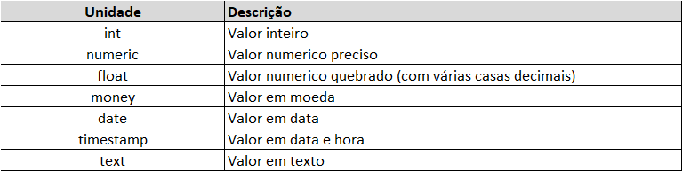
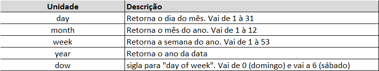

# SQL

## Anotações

### Operadores

**1 - Calcule quantos salários mínimos ganha cada cliente da tabela sales.customers. Selecione as colunas de: email, income e a coluna calculada "salários mínimos". Considere o salário mínimo igual à R$1200:**

select

	email,

	income,

	(income) / 1200 as "salários mínimos"

from sales.customers**

**2 - Na query anterior acrescente uma coluna informando TRUE se o cliente ganha acima de 5 salários mínimos e FALSE se ganha 4 salários ou menos. Chame a nova coluna de "acima de 4 salários"**

select

	email,

	income,

	(income) / 1200 as "salários mínimos",

	((income) / 1200) > 4 as "acima de 4 salários"

from sales.customers

**3 - Na query anterior filtre apenas os clientes que ganham entre 4 e 5 salários mínimos. Utilize o comando BETWEEN.**

select

	email,

	income,

	(income) / 1200 as "salários mínimos",

	((income) / 1200) > 4 as "acima de 4 salários"

from sales.customers

where ((income) / 1200) between 4 and 5

**4 - Selecine o email, cidade e estado dos clientes que moram no estado de Minas Gerais e Mato Grosso.**

select email, city, state

from sales.customers

where state in ('MT', 'MG')

**5 - Selecine o email, cidade e estado dos clientes que não moram no estado de São Paulo.**

select email, city, state

from sales.customers

where state not in ('SP')

**6 - Selecine os nomes das cidade que começam com a letra Z. Dados da tabela temp_table.regions**

select city

from temp_tables.regions

where city ilike 'z%'

### Funções agregadas

**1 - Conte quantos clientes da tabela sales.customers tem menos de 30 anos**

select count(*)

from sales.customers

where ((current_date - birth_date) / 365 ) < 30

**2 - Informe a idade do cliente mais velho e mais novo da tabela sales.customers**

select 

	max((current_date - birth_date) / 365 ),

	min((current_date - birth_date) / 365 )

from sales.customers

**3 - Selecione todas as informações do cliente mais rico da tabela sales.customers**

select *

from sales.customers

where income = (select max(income) from sales.customers)

**4 -  Conte quantos veículos de cada marca tem registrado na tabela sales.products**

select brand, count(*)

from sales.products

group by brand

order by brand 

**5 - Conte quantos veículos existem registrados na tabela sales.products**

select brand, model_year, count(*)

from sales.products

group by brand, model_year

order by brand , model_year

**6 - Conte quantos veículos de cada marca tem registrado na tabela sales.products, e mostre apenas as marcas que contém mais de 10 veículos registrados**

select brand, count(*)

from sales.products

group by brand

having count(*) > 10 

### Subqueries

**1 - Crie uma coluna calculada com o número de visitas realizadas por cada cliente da tabela sales.customers**

with numero_de_visitas as (

	select customer_id, count(*) as n_visitas

	from sales.funnel

	group by customer_id

)

select

	cus.*,

	n_visitas

from sales.customers as cus

left join numero_de_visitas as ndv

	on cus.customer_id = ndv.customer_id

### Guia de comandos

#### Operadores

#### Extração

